 
   
  
  

##

# 👋 Olá, eu sou o Daniel!

Sou apaixonado por tecnologia, aprendizado contínuo e pela criação de soluções que conectam ideias à prática. Atualmente venho desenvolvendo minhas habilidades em programação, explorando novas ferramentas e fortalecendo minha base para atuar em projetos cada vez mais completos.

## 🚀 Sobre mim

- 💻 Em evolução constante na área de tecnologia e desenvolvimento
- 📚 Estudando programação, boas práticas e novas ferramentas
- 🌎 Aprimorando meu inglês para ampliar oportunidades e conexões
- 🥋 Praticante de jiu-jitsu, levando disciplina e constância também para os estudos
- 🎮 Entusiasta de games e experiências interativas
- ☕ Café como parceiro de foco, criatividade e produtividade

## 💡 O que você encontra aqui

- Projetos de estudo e prática em desenvolvimento
- Experimentos com tecnologias, linguagens e ferramentas
- Uma jornada real de aprendizado, evolução e construção de portfólio

---

⭐ Transformando curiosidade em código e ideias em projetos.

##

  
  

##

  <picture>
    <source media="(prefers-color-scheme: dark)" srcset="https://raw.githubusercontent.com/DanielSantanaSilva/DanielSantanaSilva/output/github-contribution-grid-snake-dark.svg">
    <source media="(prefers-color-scheme: light)" srcset="https://raw.githubusercontent.com/DanielSantanaSilva/DanielSantanaSilva/output/github-contribution-grid-snake.svg">
    
  </picture>

